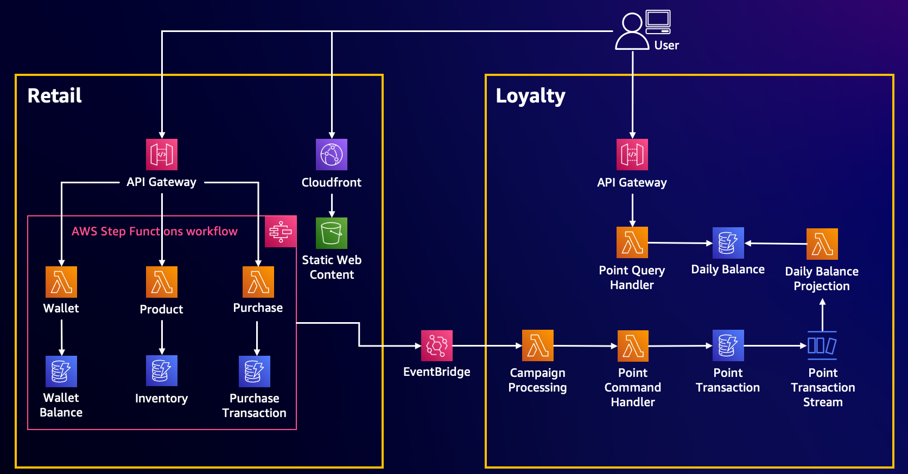

# Welcome to Implementing Distributed Design Patterns on AWS!

This repository demonstrate how to implement distributed design patterns, apply AWS services and deploy on AWS. The selected use case is the Retails and Loyalty platform where the user can select and buy a unicorn to get the loyalty rewards (points).

> :warning: **_Disclaimer_**
> The code sample in this respository tends to demonstrate the design patterns and implementation on AWS which will not be a production ready. The authentication will be bypassed for demonstration purpose. As well as the error handling may not be well handled.

## High Level Architecture

This project demonstrates the implementation of the follow architecture using AWS Cloud Development Kits and Serverless technologies (AWS Lambda, Amazon API Gateway and DynamoDB) to realize the retail and loyalty system architecture for accepting the purchase request and proceed the point issuing and redemption commands. As well as an API for retrieving point balance with point expiration logic.



---

## Project Structure

Figure below depicts project structure and explanation for each of them.

```text
├── application
│   ├── lambda
|   |   ├── layers (folder to store lambda layers dependencies management)
|   |   |   ├── points (module, domain for lambda layer)
|   |   |   |   ├── requirements.txt (dependencies for lambda layer)
|   |   |   |   ├── lib
|   |   |   |   |   ├── python (installed libraries stored here, will be git ignored)
|   |   ├── retails
|   |   ├── campaigns
|   |   ├── points
|   |   |   ├── adapters (repositories, realize output port interface)
|   |   |   ├── handlers (entry point)
|   |   |   ├── models (domain models, aggregates)
|   |   |   ├── ports (input and output interfaces)
|   |   |   ├── services (services, realize input port interface)
|   |   ├── (other domains)
├── webapp (React Web Application)
├── infrastructure (CDK project, python)
|   ├── campaign (Campaign Stack)
|   ├── point (Point Stack)
|   ├── retail (Retail Stack)
|   ├── application_stack.py (Common Stack)
|   ├── app.py
|   ├── cdk.json
|   ├── requirements.txt (dependencies for CDK project)
```

## Installation Instruction

### Prerequisites

- [Python3](https://docs.python.org/3/using/index.html)
- [AWS Cloud Development Kit (CDK)](https://docs.aws.amazon.com/cdk/v2/guide/getting_started.html)

### Setup the virtualenv

To manually create a virtualenv on MacOS and Linux:

```sh
python3 -m venv .venv
```

After the init process completes and the virtualenv is created, you can use the following step to activate your virtualenv.

```sh
source .venv/bin/activate
```

If you are using Windows platform, you could activate the virtualenv like this:

```cmd
.venv\Scripts\activate.bat
```

### Build and Install Dependencies

To build and deploy this project, simply follow the instructions below.

#### Install and Build Lambda Layer Dependencies

First, make sure you have a virtualenv activated, then navigate to lambda layer folder.

```sh
cd application/lambdas/layers/points
```

Install required dependencies to target folder `lib/python`

```sh
pip install -r requirements.txt -t lib/python
```

#### Install and Build React Web Application (Unicorn Store)

Navigate to webapp folder

```sh
cd ../../../../webapp
```

Install dependencies

```sh
npm install
```

Build and create a web package

```sh
npm run build
```

### Deploy Application

```sh
cd ../infrastructure
```

Make sure you have a virtualenv activated, then install the required dependencies.

```sh
pip install -r requirements.txt
```

If you haven't used CDK on the AWS account before, run `cdk bootstrap` once.

```sh
cdk bootstrap
```

At this point you can now synthesize the CloudFormation template for this code.

```sh
cdk synth --all
```

And then deploy your application! The first deployment may take around 10-15 minutes.

```sh
cdk deploy --all
```

### Configuring API Gateway

After the deployment completed, open [CloudFormation Console](https://console.aws.amazon.com/cloudformation/home) and look for `ApplicationStack`. Select `Outputs` tab. Copy the value of `APIURL` and replace `API_ENDPOINT` on `/webapp/src/util/constants.js` with this value.

The result may look like this

```javascript
export const API_ENDPOINT =
  "https://atnodkan96.execute-api.us-west-1.amazonaws.com/prod/"; // replace with the value of APIURL from CloudFormation Outputs
export const DEMO_USER_ID = "derick";
export const DEMO_USER_DISPLAY_NAME = "Derick";
```

Run the following commands to package and redeploy application. This might take around 5 minutes.

```sh
cd ../webapp
npm run build
cd ../infrastructure
cdk deploy
```

### Data Preparation - DynamoDB Sample Data

In order to make this demo works, we need to prepare some test data on DynamoDB tables as follows.
Open [DynamoDB Console](https://console.aws.amazon.com/dynamodbv2/home) and insert the following items to ProductsTable, UserWalletTable and CampaignTable.

#### ProductsTable Sample Data

```javascript
{
  "id": {
    "S": "1"
  },
  "description": {
    "S": "Lastest Unicorn Air model from re:Invent 2023"
  },
  "image": {
    "S": "<<IMAGE_URL>>" // replace with your image url
  },
  "name": {
    "S": "Unicorn Air (2023 Model)"
  },
  "price": {
    "N": "1700"
  },
  "stock": {
    "N": "4"
  }
}
```

#### UserWalletTable Sample Data

```javascript
{
  "username": {
    "S": "derick"
  },
  "balance": {
    "N": "3300"
  }
}
```

#### CampaignTable Sample Data

```javascript
{
  "client": {
    "S": "UnicornStore"
  },
  "campaign_name": {
    "S": "1"
  },
  "rules": {
    "S": "[{\"variable\":\"$.amount\",\"condition\": {\"rule\": \"numeric_greater_than\",\"value\": 100},\"action\" : {\"command\" : \"issue\",\"formula\" : \"$.amount/10\"}}]"
  }
}
```

## Testing

### Unicorn Store Web

Open [CloudFormation Console](https://console.aws.amazon.com/cloudformation/home) and looks for `RetailStack`. Select ApplicationStack and open `Outputs` tab. You will see `WebDistributionURL`. Copy the value and add `/index.html` at the end.

The result may look like this "[https://d1qe4uyajx6pqx.cloudfront.net/index.html](https://d1qe4uyajx6pqx.cloudfront.net/index.html)"

Open your favorite web browser to test your Unicorn Store Web!


## API Testing

This section describes the API testing method. You will need to replace the `{api_gateway_url}` with the `APIURL` value that captured from previous section (Configuring API Gateway).

### Points API

Section below provide example for testing the API from REST API client.

> _NOTE:_ You can use any valid string as `account_id`. For actual/production works, account_id should be hidden and extracted from authorized user.

#### Point Issueing API

Invoke `/points` with method `POST` to perform points issuing request.

```javascript
POST https://{api_gateway_url}/points HTTP/1.1
content-type: application/json

{
    "account_id": "1234",
    "amount" : 100
}
```

You can use the following `curl` command

```sh
curl -X POST -d '{"account_id": "1234", "amount" : 100 }' -H 'Content-Type: application/json' https://{api_gateway_url}/points
```

#### Point Balance API

Invoke `/points` with method `GET` to retrieve latest point balance.

```javascript
GET https://{api_gateway_url}/points?account_id=1234 HTTP/1.1
```

#### Point Redemption API

Invoke `/points` with method `DELETE` to perform points redemption request.

```javascript
DELETE https://{api_gateway_url}/points HTTP/1.1
content-type: application/json

{
    "account_id": "1234",
    "amount" : 100
}
```

## Key Contributors

### Derick Chen

[LinkedIn](https://www.linkedin.com/in/derick-chen/) | [Github](https://github.com/buildwithdc)

- Solution design for Retail Service
- Saga Orchestration implementation
- Frontend web app implementation

### Kunaruk Osatapirat

[LinkedIn](https://www.linkedin.com/in/osataken/) | [Github](https://github.com/osataken)

- Solution design for Loyalty Service
- Event Sourcing and CQRS implementation
- Cloud Development Kit IaC development

### Dasapich Thongnopnua

[LinkedIn](https://www.linkedin.com/in/dasapich/)

- Load testing
- Cloud Development Kit IaC development

### Natavit Rojcharoenpreeda

[LinkedIn](https://www.linkedin.com/in/natavitroj/)

- Backend development for Event Sourcing and CQRS
- Cloud Development Kit IaC development

### Wanich Keatkajonjumroen

[LinkedIn](https://www.linkedin.com/in/wanich-keatkajonjumroen-909364196/)

- Campaign engine backend development
- Campaign engine web app UI development
